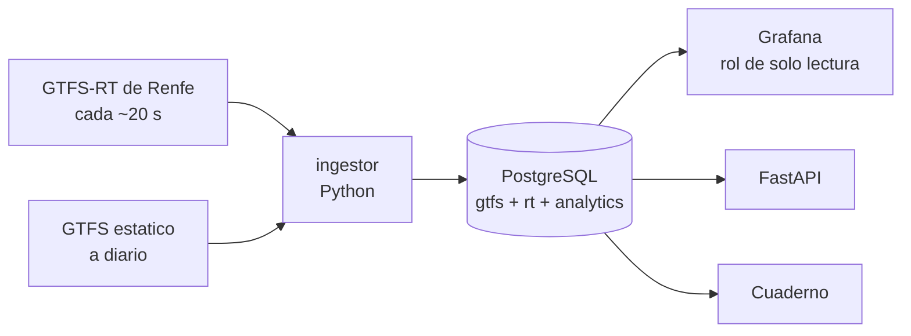

# Observatorio de puntualidad de Cercanias

[](https://github.com/Abadalina/rodalies-observatorio/actions/workflows/ci.yml)
[](LICENSE)
[](pyproject.toml)
[](pyproject.toml)

**Renfe publica en abierto el retraso de sus trenes de Cercanias, pero solo el
instante actual. Este proyecto construye el historico que no existe.**

Un ingestor consulta los feeds GTFS-Realtime cada minuto y guarda cada
observacion en PostgreSQL. Captura **los quince nucleos de Cercanias de Espana**,
de Ferrol a Malaga, y una capa analitica en SQL responde a las preguntas que el
feed no puede: **que linea, que estacion y que franja horaria acumulan retraso de
verdad, y como se comparan unas ciudades con otras**.

## Que se puede preguntar

Cosas que hoy no responde nadie mas, porque nadie mas guarda la serie:

- ¿Va Rodalies peor que Cercanias de Madrid? ¿Cuanto peor?
- ¿Que linea de la red espanola es la menos puntual?
- ¿A que hora conviene no coger la R4?
- ¿El retraso se acumula a lo largo del recorrido o aparece de golpe?
- ¿Empeora los viernes? ¿Y en agosto?

Los datos se filtran por **comunidad autonoma, provincia, nucleo, linea y
estacion**, asi que la misma serie sirve para una pregunta local y para una
comparativa nacional.

## Por que se llama Rodalies

Porque empezo ahi. La pregunta original era sobre la R2 de Barcelona, y el
analisis y los paneles siguen abriendo en Catalunya por defecto.

Pero capturar solo un nucleo habria sido un error irreversible: **lo que no se
captura hoy no existe nunca**. Ampliarlo a toda Espana costaba 27 GB al ano en
vez de 9, sobre un disco de 232 GB. Y convirtio una pregunta local en una
comparativa que nadie mas puede hacer.

| | |
|---|---|
| **Alcance capturado** | Los quince nucleos de Cercanias de Espana |
| **Vista por defecto** | Catalunya, de donde viene el proyecto |
| **Se cambia** | Con un desplegable en el panel |

---

## Verlo funcionando en un comando

```bash
docker compose -f docker-compose.demo.yml up -d --build
```

Levanta el stack entero con una red de Rodalies **simulada**: hora punta,
propagacion del retraso a lo largo del recorrido e incidencias esporadicas. No
necesita conexion, ni credenciales, ni esperar dias a que se acumule historico.

- Paneles: <http://localhost:3001> (`admin` / `admin`)
- API: <http://localhost:8001/docs>

El perfil de demostracion usa **volumen, credenciales y puertos propios**. No
puede tocar el historico real ni por accidente, y todo lo que escribe queda
marcado con `source = 'synthetic'`.

## Capturar datos reales

```bash
cp .env.example .env      # rellena POSTGRES_PASSWORD, READONLY_PASSWORD y GRAFANA_PASSWORD
docker compose up -d --build
docker compose logs -f ingestor
```

- Paneles: <http://localhost:3000>
- API: <http://localhost:8000/docs>

Ningun puerto se publica fuera de `127.0.0.1`. Para exponer el panel hace falta
un proxy inverso con TLS delante; esta explicado en
[docs/RUNBOOK.md](docs/RUNBOOK.md).

En Windows: `.\scripts\rodalies.ps1 demo` o `.\scripts\rodalies.ps1 up`.

---

## Por que existe

Puedes consultar ahora mismo si la R2 lleva retraso. Lo que no puedes saber es
si ocho minutos un martes a las ocho de la manana es normal o es un mal dia,
porque **ese historico no lo publica nadie**.

Construirlo solo se puede hacer de una forma: capturando el presente, un minuto
detras de otro. Cada dia que el ingestor corre, el conjunto de datos vale mas, y
cada dia que no corre es un dia que no se recupera.

## Que hace

- **Captura continua** de los tres feeds GTFS-Realtime de Renfe (circulaciones,
  incidencias y posiciones) de los quince nucleos, con tolerancia a fallos.
- **Territorio en cada estacion**: provincia y comunidad autonoma. Oficial en el
  57,6 % (listado de Renfe) e inferida por cercania en el resto, siempre
  marcando cual es cual.
- **Historico propio en PostgreSQL**, particionado por mes, idempotente y con
  registro de cada consulta al feed, tambien de las fallidas.
- **Analisis en SQL**: puntualidad, mediana y percentiles por linea, estacion y
  franja horaria, con vistas materializadas y refresco concurrente.
- **Paneles de Grafana** provisionados como codigo, conectados con un rol de
  solo lectura.
- **API de solo lectura** con FastAPI y documentacion automatica.
- **Cuaderno** de analisis exploratorio con pandas y NumPy.
- **Comprobaciones de calidad de datos** y vigilancia diaria de la fuente en CI.

## Arquitectura



Detalle en [docs/ARQUITECTURA.md](docs/ARQUITECTURA.md).

---

## Decisiones que conviene poder defender

Las que tienen alternativa razonable estan justificadas en
[docs/DECISIONES.md](docs/DECISIONES.md). Las que mas se notan:

**Un solo parser para los dos formatos.** Renfe publica cada feed en protobuf y
en JSON. Se comprobo que `MessageToDict()` sobre el protobuf produce exactamente
la misma estructura que el JSON, asi que el formato es un detalle de transporte y
no una bifurcacion logica. Un test lo verifica en cada push con dos capturas
reales del mismo instante.

**Sin claves ajenas entre el tiempo real y el horario, pero con marca.** Si Renfe
estrena un tren que aun no esta en el GTFS, una clave ajena convertiria esa
observacion en un error de insercion, es decir, en un dato perdido para siempre.
Se guarda con `matched_gtfs = false` y una comprobacion de calidad vigila que la
proporcion no se dispare. Perder una fila es irreversible; un `JOIN` vacio no.

**La hora programada se congela sobre el hecho.** El GTFS se reemplaza cada dia:
comparar una observacion de hace tres meses contra el horario de hoy daria un
resultado distinto en cada ejecucion. El feed ya trae la informacion
(`programada = prevista - retraso`), asi que se guarda con la observacion.

**Un feed sin marca de tiempo se rechaza, no se rellena.** Poner la hora actual
convertiria un mensaje incompleto en un dato con aspecto correcto, y esa marca
forma parte de la clave primaria del historico.

**Dos familias de indicador, no una.** `retraso_medio_s` es la desviacion firmada
(un tren adelantado da negativo); `demora_media_s` recorta los adelantos a cero.
La primera describe la distribucion, la segunda lo que sufre el viajero. Se
publican las dos y cada panel dice cual usa.

**El origen forma parte de la clave.** Una observacion sintetica no puede
colisionar con una real ni silenciarla. Ademas los perfiles `demo` y `live`
tienen volumenes separados.

Modelo completo en [docs/MODELO_DATOS.md](docs/MODELO_DATOS.md).

## Comandos

| Comando | Que hace |
|---|---|
| `make demo` / `make up` | Levanta el stack sintetico o el real |
| `make logs` | Sigue el log del ingestor |
| `make check` | Comprobaciones de calidad de datos |
| `make stats` | Resumen del historico acumulado |
| `make export` | Vuelca el historico a CSV |
| `make backup` | Copia de seguridad del historico |
| `make test` / `make lint` / `make typecheck` | Tests, estilo y tipado |

La herramienta de linea de comandos por debajo:

```
rodalies migrate      aplica las migraciones pendientes
rodalies load-gtfs    descarga y carga el horario programado
rodalies poll         una consulta a los feeds (para depurar)
rodalies run          bucle de ingesta continuo
rodalies refresh      refresca la capa analitica
rodalies check        comprobaciones de calidad
rodalies stats        resumen del historico
rodalies export       exporta el conjunto de datos a CSV
rodalies capture      guarda los feeds crudos en disco
```

## La API

```bash
curl "localhost:8000/lineas?nucleo=51&desde=2026-09-01&hasta=2026-09-30"
curl "localhost:8000/franjas?linea=R2N"
curl "localhost:8000/estaciones?limite=10"
curl "localhost:8000/trenes/5135M77534R4"
curl "localhost:8000/salud"     # 503 si CUALQUIER feed activo esta obsoleto
```

Documentacion interactiva en `/docs`.

## Calidad

```bash
pytest -v                                              # unitarios
RODALIES_TEST_DATABASE_URL=postgresql://... pytest -v   # + integracion
ruff check . && ruff format --check .
mypy                                                    # estricto
python scripts/check_source.py                          # la fuente sigue igual
```

En cada push, GitHub Actions ejecuta cinco trabajos: estilo y tipado estricto,
tests unitarios e integracion contra un PostgreSQL real, una prueba de extremo a
extremo con la fuente sintetica que llega hasta exportar el conjunto de datos, la
construccion de la imagen y la validacion de los dos perfiles de Compose.

Ademas, **una vez al dia** se valida el feed en vivo de Renfe. Si cambian el
formato, el trabajo falla y abre una incidencia automaticamente: un aviso que no
falla no es un aviso.

Los tests unitarios corren contra **capturas reales del feed**
(`tests/fixtures/`), y el fixture del GTFS reproduce a proposito las rarezas del
fichero de Renfe: relleno de espacios en las cabeceras y horas por encima de
`24:00:00`.

## Estructura

```
rodalies-observatorio/
├── src/rodalies/            # paquete Python (mypy --strict limpio)
│   ├── config.py            # configuracion validada con Pydantic
│   ├── parsing.py           # decodificacion y normalizacion de GTFS-RT
│   ├── gtfs_static.py       # lectura en streaming del horario programado
│   ├── ingest.py            # orquestacion y bucle continuo
│   ├── repository.py        # todo el SQL de escritura
│   ├── healthcheck.py       # salud real del contenedor
│   ├── sources/             # renfe | synthetic | replay
│   └── api/                 # FastAPI de solo lectura
├── db/migrations/           # esquema, analitica, calidad y roles, versionados
├── grafana/                 # origen de datos y paneles provisionados
├── notebooks/               # analisis exploratorio con pandas
├── tests/                   # unitarios + integracion, con capturas reales
├── docs/                    # arquitectura, modelo, fuente, runbook, decisiones
├── scripts/                 # utilidades y atajos para Windows
├── docker-compose.yml       # captura real (exige .env)
└── docker-compose.demo.yml  # demostracion sintetica, sin credenciales
```

## Documentacion

| Documento | Para que |
|---|---|
| [FUENTE_DATOS.md](docs/FUENTE_DATOS.md) | Que publica Renfe, que se ha verificado y que supuestos se hacen |
| [ARQUITECTURA.md](docs/ARQUITECTURA.md) | Componentes, flujo y por que no hay mas piezas |
| [MODELO_DATOS.md](docs/MODELO_DATOS.md) | Esquema, particionado, indices y capa analitica |
| [DECISIONES.md](docs/DECISIONES.md) | Decisiones con su alternativa descartada |
| [RUNBOOK.md](docs/RUNBOOK.md) | Que hacer cuando algo falla |
| [COMO_FUNCIONA.md](docs/COMO_FUNCIONA.md) | **Empieza por aqui**: el planteamiento, las preguntas frecuentes y los limites |
| [HISTORIA.md](docs/HISTORIA.md) | De donde sale esta version y que se corrigio |
| [POST.md](docs/POST.md) | Borrador del articulo divulgativo |
| [DESPLIEGUE.md](docs/DESPLIEGUE.md) | Montarlo en un VPS desde cero |

---

## Datos y limitaciones

Los datos proceden de los conjuntos abiertos de **Renfe**
(<https://data.renfe.com>), publicados bajo **Creative Commons Attribution 4.0**.
El codigo de este repositorio es MIT. Cualquier conjunto derivado que se publique
debe mantener la atribucion a Renfe.

Limitaciones que conviene decir antes de que las pregunten:

- Se mide **lo que Renfe publica**, no lo que ocurre. La ausencia de una entidad
  en el feed no demuestra que un tren no circulara.
- El feed informa de **llegadas**, no de salidas.
- Una **supresion** aparece como parada `SKIPPED`, sin retraso asociado. Es peor
  que cualquier retraso y no entra en ninguna media: se cuenta aparte.
- Una misma parada aparece en varias consultas mientras el tren se acerca. Los
  agregados usan `analytics.mv_stop_final`, que se queda con la ultima
  observacion; sin esa vista, las medias describirian instantaneas, no trenes.
- El historico empieza el dia que arranca la captura. No hay forma de recuperar
  el pasado.

## Estado

- [x] Ingestor continuo, idempotente y tolerante a fallos
- [x] Esquema con particionado, indices, capa analitica y rol de solo lectura
- [x] Docker Compose con perfiles `demo` y `live` separados
- [x] Paneles de Grafana provisionados como codigo
- [x] Tests unitarios y de integracion, `mypy --strict` y CI en GitHub Actions
- [x] Cuaderno de analisis con pandas y NumPy
- [x] Documentacion tecnica y operativa
- [x] **Capturando en produccion** desde el 26/08/2026, los quince nucleos
- [x] Copias de seguridad automaticas, verificadas y fuera del servidor
- [ ] Capturas de pantalla de los paneles (ver `docs/img/LEEME.md`)
- [ ] Panel publico con dominio y TLS
- [ ] Conjunto de datos publicado con ficha y licencia
- [ ] Modelo de prediccion de retraso (cuando haya meses de historico)

## Licencia

[MIT](LICENSE) — Alejandro Abadal Goula. Datos de Renfe bajo CC BY 4.0.
