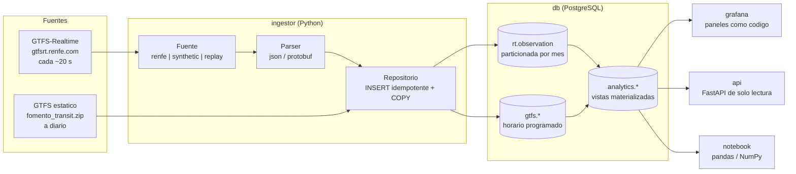

# Arquitectura

## Vista general

## Los cuatro servicios

| Servicio | Que hace | Por que asi |
|---|---|---|
| `db` | PostgreSQL 16 con volumen persistente | El historico es el activo del proyecto; el volumen no se toca sin copia previa |
| `ingestor` | Bucle continuo: consulta feeds, carga horario, refresca vistas | Un solo proceso, sin planificador externo: menos piezas que se puedan caer |
| `api` | FastAPI de solo lectura sobre la capa analitica | Da una URL que se puede abrir y documentacion automatica en `/docs` |
| `grafana` | Paneles provisionados desde ficheros del repositorio | Reproducible desde cero; entra con un rol de **solo lectura**, nunca con el dueno del esquema |

El ingestor y la API **comparten imagen**: mismo codigo, distinto comando. Evita
que se desincronicen y ahorra una construccion entera en la CI.

## El ciclo del ingestor

Tres tareas periodicas comparadas contra un reloj monotono, sin dependencias
externas:

| Tarea | Cadencia | Que hace |
|---|---|---|
| Consulta de feeds | 60 s | Descarga, normaliza e inserta observaciones |
| Refresco analitico | 15 min, **y una vez en cuanto entra la primera captura** | `REFRESH MATERIALIZED VIEW CONCURRENTLY` |
| Recarga del horario | 24 h | Descarga condicional del GTFS y recarga por COPY |

La cadencia de consulta se programa **desde el reloj, no desde el final del
ciclo**: si un ciclo tarda de mas, el siguiente no se desplaza y la serie mantiene
su ritmo.

### Reglas que el bucle no rompe nunca

1. **No aborta.** Un fallo de red, un feed corrupto o una caida de la base de
   datos se registran y se reintenta en el ciclo siguiente. Un ingestor muerto
   pierde dias; uno que falla y sigue pierde un minuto.
2. **No inventa.** Un feed sin marca de tiempo valida se rechaza en lugar de
   guardarse con la hora actual. Rellenar el hueco convertiria un mensaje
   incompleto en un dato de aspecto correcto, y esa marca forma parte de la
   clave primaria del historico.
3. **Todo intento queda anotado** en `rt.feed_poll`, tambien los fallidos. Sin
   ese registro es imposible distinguir "no hubo trenes" de "fallo la captura",
   y esa diferencia es exactamente lo que hace creible un historico.
4. **Idempotente.** La clave natural `(feed_timestamp, trip_id, stop_id)` con
   `ON CONFLICT DO NOTHING` permite reprocesar cualquier captura sin duplicar.
5. **Si el feed no ha cambiado, no se reprocesa**: se compara la marca de tiempo
   de la cabecera con la ultima procesada y se anota el intento como
   `unchanged`.

## Dos ficheros, dos mundos separados

Hay dos ficheros de Compose con **volumen, credenciales y puertos propios**.
Son ficheros distintos, no perfiles del mismo: Compose interpola el fichero
entero antes de filtrar por perfil, asi que tenerlos juntos obligaria a definir
las contrasenas de produccion solo para arrancar la demo.

| Fichero | Fuente | Volumen | Para que |
|---|---|---|---|
| `docker-compose.yml` | Renfe en tiempo real | `pgdata_live` | El historico de verdad |
| `docker-compose.demo.yml` | Red simulada | `pgdata_demo` | Ensenar el proyecto sin red ni espera |

Separarlos fisicamente es mas simple y mas seguro que hacerlos convivir en la
misma base. Con un solo volumen, cambiar de modo podia sustituir el catalogo GTFS
asociado a observaciones ya guardadas, y bastaba un despiste para mezclar datos
inventados con reales. Ahora no hay despiste posible: son bases distintas.

Ademas, `source` forma parte de la clave primaria y de todos los agregados, de
modo que ni aun compartiendo base podrian pisarse.

## Seguridad por defecto

- Ningun puerto se publica fuera de `127.0.0.1`.
- Grafana se conecta con `rodalies_lectura`, un rol sin permiso de escritura
  sobre ninguna tabla ni de ejecucion sobre las funciones de mantenimiento.
- El acceso anonimo al panel esta cerrado; abrirlo es una decision explicita y
  solo tiene sentido detras de un proxy con TLS.
- Compose **exige** que las tres contrasenas esten definidas: no hay valores por
  defecto que se queden puestos sin querer.

## Las tres fuentes intercambiables

Cambiar de fuente es cambiar `RODALIES_SOURCE`, no tocar codigo.

- **`renfe`** — produccion. Descarga de los endpoints publicos.
- **`synthetic`** — demostracion y tests. Genera una red de Rodalies simulada con
  retraso base por linea, hora punta, propagacion a lo largo del recorrido y cola
  de incidencias. Determinista: el mismo instante produce siempre el mismo feed.
  Permite que `docker compose -f docker-compose.demo.yml up` llene los paneles en
  segundos, sin conexion y sin esperar dias de historico.
- **`replay`** — reproduce capturas guardadas en `data/captures/`, en bucle. Util
  para ensenar el proyecto con datos reales sin depender de la red, o para
  reproducir un incidente concreto.

Los datos sinteticos se guardan con `source = 'synthetic'` y **jamas se agregan
junto a los reales**: `source` es columna de agrupacion en todas las vistas y hay
un test de integracion que lo garantiza.

## Por que no hay mas piezas

El proyecto podria llevar dbt, Airflow, Kafka o un almacen columnar. No los
lleva, y es una decision, no una carencia:

- **Volumen**: unas **70.000 filas al dia** para Rodalies Barcelona, medido
  sobre el feed real (~65 paradas informadas por sondeo, con servicio de 05:00
  a 23:00; de noche el feed va vacio). Son ~26 millones al ano, unos 9 GB con
  indices. PostgreSQL con particionado mensual va sobrado durante anos.
- **Planificacion**: tres tareas periodicas en un bucle. Airflow anadiria mas
  piezas que trabajo hace.
- **Transformaciones**: vistas materializadas en SQL, versionadas en migraciones.
  dbt aportaria linaje y documentacion, pero tambien otro tiempo de ejecucion y
  otro lenguaje de plantillas. Lo que si aporta dbt de verdad —los tests de
  datos— esta cubierto por `analytics.v_quality_checks`.

Cada pieza que hay se puede defender en una entrevista en una frase. Ese fue el
criterio.
