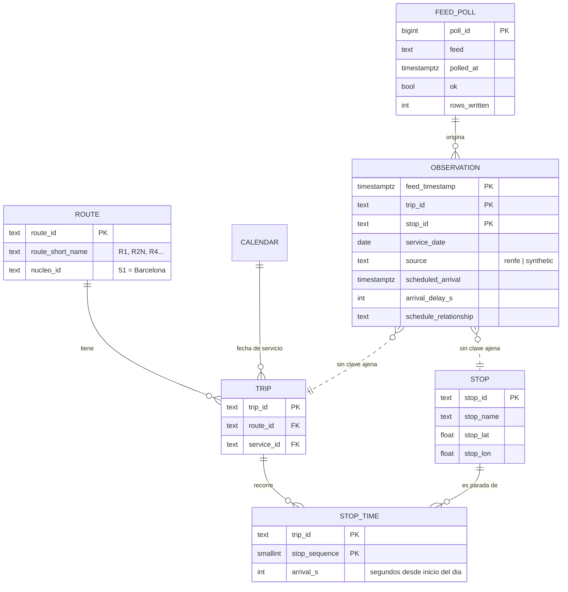

# Modelo de datos

## Tres esquemas, tres responsabilidades

| Esquema | Contenido | Ciclo de vida |
|---|---|---|
| `gtfs` | Horario programado publicado por Renfe | Se **reemplaza entero** cada dia |
| `rt` | Observaciones crudas del tiempo real | Solo se **inserta**; jamas se borra ni se actualiza |
| `analytics` | Vistas y agregados derivados | Se **recalcula** desde `rt` y `gtfs` |

La separacion no es decorativa: dice quien puede escribir donde. `rt` es la
unica fuente de verdad irreemplazable; todo lo demas se puede reconstruir.



## Cuatro decisiones que conviene poder explicar

### 1. Ninguna clave ajena de `rt` hacia `gtfs`, pero con marca

Parece un descuido y es lo contrario. El tiempo real tiene que poder escribirse
**aunque el horario descargado este obsoleto** o aunque Renfe estrene un tren que
todavia no aparece en el GTFS. Una clave ajena convertiria ese caso en un fallo
de insercion, es decir, en una observacion perdida para siempre.

Perder una fila es irreversible; un `JOIN` que no encuentra pareja, no.

La observacion se guarda con `matched_gtfs = false` y dos comprobaciones de
calidad vigilan la proporcion (`observaciones_huerfanas` y
`circulaciones_sin_horario`). Si se dispara, el horario esta caduco o Renfe ha
cambiado los criterios; en ninguno de los dos casos la respuesta correcta es
tirar el dato.

### 2. La hora programada se guarda desnormalizada en el hecho

`rt.observation.scheduled_arrival` podria calcularse uniendo con
`gtfs.stop_time`. No se hace, por dos razones:

- El GTFS **se reemplaza cada dia**. Una observacion de hace tres meses tendria
  que compararse contra un horario que ya no existe: el analisis daria un
  resultado distinto cada vez que se ejecutara.
- El feed ya trae la informacion: `hora programada = hora prevista - retraso`.
  Es autosuficiente y no depende de que el horario este cargado.

Es el patron clasico de congelar la dimension sobre el hecho en el momento en
que ocurre, en vez de mantener una dimension historificada.

### 3. Particionado mensual por rango

```sql
CREATE TABLE rt.observation (...) PARTITION BY RANGE (feed_timestamp);
```

A un sondeo por minuto, Rodalies Barcelona genera unas **70.000 filas al dia**
(~65 paradas informadas por sondeo en horario de servicio; de noche el feed va
vacio), unos 26 millones al ano. Capturar los quince nucleos multiplicaria la
cifra por cinco y medio: ~380.000 al dia. El particionado mantiene acotadas las consultas por rango de
fechas (el planificador descarta particiones enteras) y el mantenimiento
(`VACUUM`, reindexado, futuros archivados).

`rt.ensure_partitions(1, 3)` crea las particiones de un mes atras y tres
adelante; el ingestor la llama al arrancar. Existe ademas una **particion por
defecto** como red de seguridad: antes una fila mal colocada que una fila
rechazada.

### 4. La clave primaria es natural, no un contador

`PRIMARY KEY (source, feed_timestamp, trip_id, stop_id)`

El `source` va **dentro** de la clave, no al lado. Sin el, una observacion de
demostracion con la misma marca de tiempo y el mismo tren silenciaba a la real
con un `ON CONFLICT DO NOTHING`, y el historico perdia el dato bueno sin que
nada lo avisara. Lo mismo aplica a `rt.alert` y a `rt.vehicle_position`.

Con `ON CONFLICT DO NOTHING`, reprocesar una captura guardada no duplica nada:
la idempotencia sale del modelo, no de codigo defensivo. Ademas es la clave de
particionado (PostgreSQL exige que la incluya) y ahorra la columna de
contador y su indice.

## El territorio de cada estacion

El GTFS no dice donde esta una estacion mas alla de sus coordenadas, y el nucleo
de Cercanias **no es una unidad administrativa**: el 41 cubre Murcia y Alacant, y
Rodalies llega hasta Zaragoza y Teruel. Para poder filtrar por comunidad autonoma
y provincia, `gtfs.stop` lleva cuatro columnas mas.

| Columna | De donde sale |
|---|---|
| `provincia`, `poblacion`, `codigo_postal` | [Listado oficial de estaciones de Renfe](https://ssl.renfe.com/ftransit/Fichero_estaciones/estaciones.csv) |
| `comunidad` | De la provincia, con una tabla estatica (47 provincias, sin huecos) |
| `geo_origen` | `oficial` o `inferida` |

El listado oficial trae 1.027 estaciones con provincia utilizable, pero solo
**669 de ellas existen tambien en el GTFS** (el 57,6 % de las 1.162). Para las
493 restantes se toma la provincia de la **estacion etiquetada mas cercana**, y
la fila queda marcada como `inferida`.

Esa inferencia se valido dejando fuera cada estacion oficial y prediciendola con
su vecina: **acerto el 90,9 %**, y los fallos se concentran en fronteras
provinciales. Es un dato util, no es oficial, y cualquier analisis que necesite
rigor lo excluye con `WHERE geo_origen = 'oficial'`. La poblacion **nunca** se
infiere: eso seria inventarsela.

## La capa analitica

```
rt.observation                       hechos crudos, una fila por observacion
      |
      v
analytics.mv_stop_final              DISTINCT ON: ultimo estado por tren y parada
      |
      +--> analytics.mv_line_daily     por linea y dia
      +--> analytics.mv_station_daily  por estacion y dia
      +--> analytics.mv_line_hour      por linea y franja horaria
                |
                v
        vistas en vivo: v_kpi_dia, v_ranking_lineas, v_ranking_estaciones,
                        v_ingest_health, v_alertas_activas, v_quality_checks
```

**`mv_stop_final` es la pieza central.** El feed reporta la misma parada muchas
veces mientras el tren se acerca; la ultima observacion es la mejor estimacion
del retraso realmente sufrido. `DISTINCT ON` es la forma de PostgreSQL de
resolver ese "primero por grupo" sin funcion de ventana ni subconsulta
correlacionada.

Todas las vistas materializadas tienen **indice unico**, requisito para
`REFRESH MATERIALIZED VIEW CONCURRENTLY`, que recalcula sin bloquear a Grafana.
`analytics.refresh_all()` las refresca en el orden correcto y, si el refresco
concurrente fallara, cae al bloqueante en vez de dejar la vista sin actualizar.

## Metricas: por que no basta con la media

Los retrasos ferroviarios tienen **cola larga**: un tren parado una hora desplaza
la media de toda la linea. Por eso cada agregado guarda:

- `retraso_medio_s` — **desviacion firmada** respecto al horario: un tren
  adelantado da negativo. Describe la distribucion.
- `demora_media_s` — **solo el retraso**, con los adelantos recortados a cero.
  Describe lo que sufre el viajero, pero ya no es la media de la distribucion.
  Se publican las dos a proposito y cada panel dice cual usa: dejar que un
  tren adelantado compense a uno retrasado esconde la demora real, y recortar
  siempre a cero esconde que hay trenes que van sobrados.
- `retraso_p50_s`, `retraso_p90_s`, `retraso_p95_s` — `percentile_cont`
- `pct_puntualidad` — la metrica que entiende cualquiera
- `paradas_suprimidas` — porque una supresion es peor que cualquier retraso y no
  aparece en ninguna media

Detalle facil de equivocar: el **denominador** de la puntualidad es
`paradas_con_retraso`, no `paradas_observadas`. Una parada suprimida se observa
pero no trae retraso; meterla en el denominador la contaria como "no puntual" y
mezclaria dos fenomenos distintos. Se cuenta aparte, y hay un test de integracion
(`test_una_supresion_no_cuenta_como_impuntual`) que lo fija.

El umbral de puntualidad **no esta escrito en las consultas**: vive en
`analytics.setting` y se lee con la funcion `analytics.setting_value()`.
Cambiar la definicion de "puntual" es un `UPDATE` mas un refresco, no reescribir
seis vistas. El ingestor sincroniza ahi los valores del entorno al arrancar.

## Indices

| Indice | Para que |
|---|---|
| `rt.observation` PK `(feed_timestamp, trip_id, stop_id)` | Idempotencia y poda de particiones |
| `ix_obs_service_trip (service_date, trip_id)` | Trayectoria de un tren concreto |
| `ix_obs_stop (stop_id, service_date)` | Analisis por estacion |
| `ix_obs_route (route_id, service_date)` | Analisis por linea |
| `ix_obs_nucleo_date (nucleo_id, service_date)` | Filtro por nucleo |
| `ux_stop_final`, `ux_line_daily`, ... | Refresco concurrente de las vistas |
| `ix_alert_routes` (GIN sobre `text[]`) | Buscar avisos que afectan a una linea |
| `ix_feed_poll_errors` (parcial, `WHERE NOT ok`) | Diagnostico: solo indexa los fallos |
